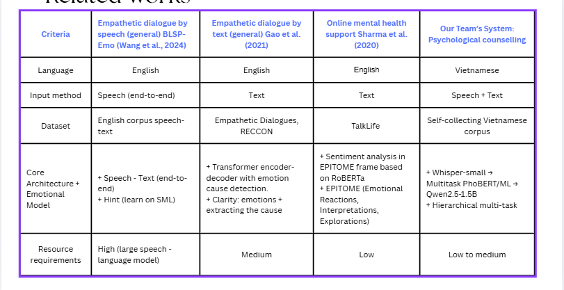

# AI Mental Health Assistant — A Multimodal Vietnamese Psychological Counseling System

Capstone Project SP26AI69 — Multimodal Emotion Understanding & Empathetic Response Generation System for psychological counseling in Vietnamese.

> Repo: [empathetic-counselling-a.i](https://github.com/huyhoang20451/empathetic-counselling-a.i)

---

## 1. Project Idea

Mental health support is a rapidly growing necessity in Vietnam. However, existing AI-powered psychological counseling solutions predominantly support English and handle data uni-directionally (either text-only or speech-only). This project builds a **Vietnamese psychological counseling assistant** capable of:

- Accepting **multimodal** inputs: speech or text.
- **Understanding emotions** at a fine-grained level (classifying specific emotional nuances rather than just broad positive/negative sentiments).
- **Generating empathetic responses** tailored to the user's emotional state and conversational context, avoiding generic or robotic replies.

The primary goal is to create an initial "listening" framework that helps users express themselves and receive empathetic feedback before transitioning to human professionals when necessary.

## 2. Related Work

The team reviewed relevant research domains: speech-based empathetic conversation (BLSP-Emo), text-based empathetic conversation (Gao et al.), and online mental health support (Sharma et al.). Most of these frameworks are tailored exclusively for English and utilize unimodal processing (either speech or text), whereas this project targets the Vietnamese language and seamlessly integrates both input modalities.



## 3. Our Solution

To address the limitations of prior works, the team proposes the following solutions:

- **Self-collected Vietnamese Dataset**: Specially curated for psychological counseling context, shifting away from generic English datasets (Empathetic Dialogues, TalkLife, etc.).
- **Multimodal Pipeline**: Allows users to input via speech (through a Speech-to-Text module) or directly via text, converging into a unified processing flow.
- **Hierarchical Emotion Recognition**: Combines a multi-task PhoBERT model with traditional Machine Learning models, classifying emotions across 2 tiers—coarse-grained categories followed by fine-grained labels—ensuring accuracy while allowing for fallback mechanisms if needed.
- **Fine-tuned Vietnamese LLM** (Qwen2.5-1.5B): Tailored specifically to generate responses that are contextually accurate and highly empathetic. It is deployed locally via llama.cpp to ensure complete control over costs and strict data privacy for sensitive user information.
- **Emotion Consistency Check**: Evaluates consistency between the emotion label determined by the LLM and the label predicted by the PhoBERT/ML classification models using cosine similarity on embeddings, enhancing overall system reliability.

## 4. System Architecture

The core architecture consists of the following components:

| Component | Role | Technology Used |
|---|---|---|
| **Speech-to-Text** | Converts Vietnamese speech into text | Fine-tuned Whisper-small (Vietnamese) |
| **Text Preprocessing** | Standardizes text (resolves teencode, performs word segmentation, etc.) | `underthesea` |
| **Emotion Understanding** | Classifies emotions in 2 tiers: coarse-grained → fine-grained | Multi-task PhoBERT **OR** Hierarchical ML models (Logistic Regression/XGBoost per emotion "expert") built on `vietnamese-sbert` embeddings |
| **Empathetic Response Generation** | Generates empathetic counseling responses accompanied by emotion tags | Fine-tuned Qwen2.5-1.5B, served via `llama-server` (llama.cpp) |
| **Emotion Consistency Check** | Computes similarity scores between the LLM's determined emotion and the classifier's predicted emotion | Cosine similarity on `vietnamese-sbert` embeddings |
| **Conversation Storage** | Logs and manages chat history broken down by session | SQLAlchemy (PostgreSQL/SQLite) |

The application features two interface modes: a full-featured version running on **FastAPI** (`app/main.py`) and a lightweight version powered by **Gradio** (`app.py`, ideal for quick demonstrations or hosting on Hugging Face Spaces).

## 5. System Sequence Diagram

```mermaid
sequenceDiagram
    participant UI as User Interface
    participant W as Whisper Service
    participant P as Text Preprocessing
    participant PB as PhoBERT Service
    participant L as LLM Service

    UI->>W: 1a. Send Audio Request
    W-->>P: 2a. Return Text
    UI->>P: 1b. Enter Direct Text
    P->>PB: 3. Clean Text
    PB-->>L: 4. Return Emotional Label
    L-->>UI: 5. Empathetic Response
